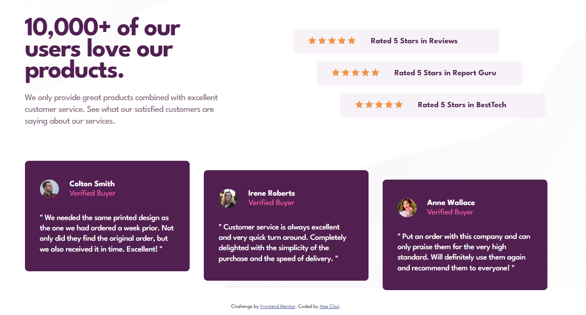
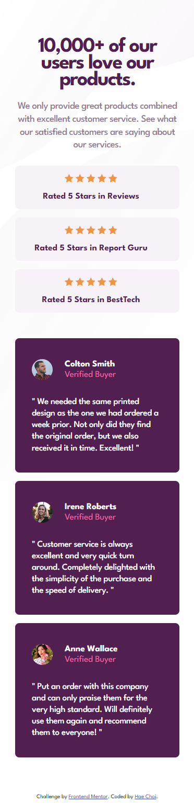

# Frontend Mentor - Social proof section solution

This is a solution to the [Social proof section challenge on Frontend Mentor](https://www.frontendmentor.io/challenges/social-proof-section-6e0qTv_bA). Frontend Mentor challenges help you improve your coding skills by building realistic projects.

## Overview

### The challenge

Users should be able to:

- View the optimal layout for the section depending on their device's screen size

### Screenshot

## My process

### Built with

- Semantic HTML5 markup
- CSS custom properties
- Flexbox
- CSS Grid

### What I learned

- When it comes to deciding whether to use flesbox or grid for the layouts I find it best to use whatever the situation calls for. I decided to use flex for the top portion of the main container because of the uneven columns.

- I was reminded that flex-basis is an important flex property when defining a major row. CSS grid makes this a little easier to do especially if the columns are the same width.

### Continued development

- Getting faster in conceptualizing/deploying layouts.

## Author

- Frontend Mentor - [@dagimchi](https://www.frontendmentor.io/profile/dagimchi)
- Twitter - [@dagimchi](https://www.twitter.com/dagimchi)
